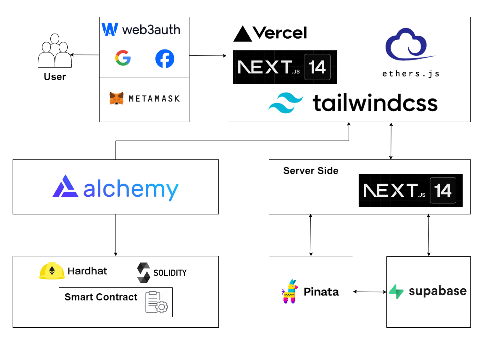
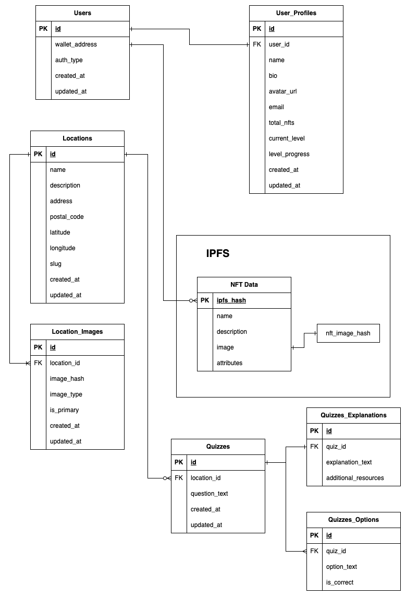

# Sample Hardhat Project

This project demonstrates a basic Hardhat use case. It comes with a sample contract, a test for that contract, and a Hardhat Ignition module that deploys that contract.

Try running some of the following tasks:

```shell
npx hardhat help
npx hardhat test "test/,,,"
npx hardhat run scripts/,,,, --network sepolia

```

## スマートコントラクトVerifyコマンド
```
npx hardhat verify --network sepolia CONTRACT_ADRESS
```

## 概要
NFTとゲーミフィケーションを使用した持続可能な観光地の促進

## アーキテクチャ図


## ER図

