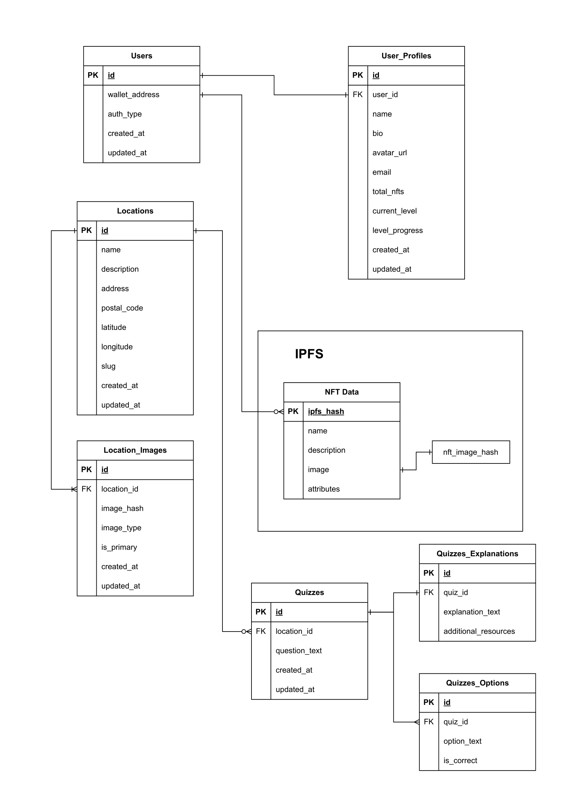

# 概要
NFTとゲーミフィケーションを使用した持続可能な観光地の促進
  ### 提供する機能
  - 観光地ごとのNFT発行
  - ガス代のためのトークンを取得するERC7221のメタトランザクションを実装したSepoliaFaucet
  - ユーザ間NFT所有数ランキング・NFT所有数によるレベル
  - 観光地ごとのクイズ機能
  - 観光地ごとのAIチャット機能

# Docs
https://ryotos-organization.gitbook.io/nftrip

# アーキテクチャ図


# ER図


# Contract Address
```
NFTRIP_ADDRESS:0xbe7EeFb23E7B970fcC05F061ba22A0E8dAd94518
FAUCET_ADDRESS:0x3dA5c533d839e7a03B1D1a674456dBCf52759d88
FORWARDER_ADDRESS:0x56823B1E1eFcb375774AE955cCE6B1960F083C70
```

# Hardhatコマンド
```shell
npx hardhat compile
npx hardhat test "test/,,,"
npx hardhat run scripts/,,,, --network sepolia
```

# スマートコントラクトVerifyコマンド
```
npx hardhat verify --network sepolia CONTRACT_ADRESS
```
